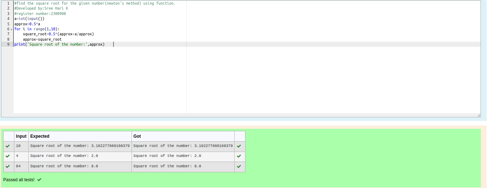

# Find the square root of a number

## AIM:
To write a program to find the square root of a number.

## Equipments Required:
1. Hardware – PCs
2. Anaconda – Python 3.7 Installation / Moodle-Code Runner

## Algorithm
1. Define a function.
2. Assign number_iters = 100 in the function to perform 100 iteratios.
3. Set i = 0.
4. Calculate  number = 0.5 * (number + a / number) for 100 iterations.
5. Return number

## Program:
```python
#find the square root for the given number(newton's method) using function.
#Developed by:Sree Hari K
#register number:2300908
a=int(input())
approx=0.5*a
for i in range(1,10):
    square_root=0.5*(approx+a/approx)
    approx=square_root
print('Square root of the number:',approx)    
 
```

## Output:



## Result:
Thus the program to find the square root for the given number(newton's method) using function is written and verified using python programming.
